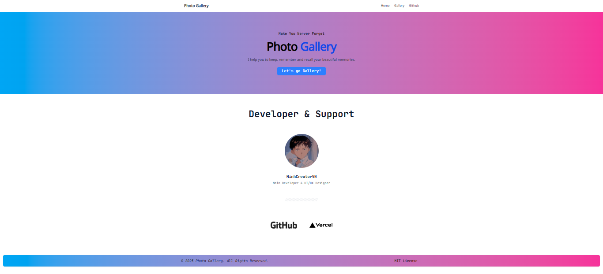

<!-- Improved compatibility of back to top link:
<a id="readme-top"></a>
<!--
*** Thanks for checking out the Best-README-Template. If you have a suggestion
*** that would make this better, please fork the repo and create a pull request
*** or simply open an issue with the tag "enhancement".
*** Don't forget to give the project a star!
*** Thanks again! Now go create something AMAZING! :D
-->


<!-- PROJECT SHIELDS -->
<!--
*** I'm using markdown "reference style" links for readability.
*** Reference links are enclosed in brackets [ ] instead of parentheses ( ).
*** See the bottom of this document for the declaration of the reference variables
*** for contributors-url, forks-url, etc. This is an optional, concise syntax you may use.
*** https://www.markdownguide.org/basic-syntax/#reference-style-links
-->
[![Contributors][contributors-shield]][contributors-url]
[![Forks][forks-shield]][forks-url]
[![Stargazers][stars-shield]][stars-url]
[![Issues][issues-shield]][issues-url]
[![MIT License][license-shield]][license-url]


<!-- PROJECT LOGO -->
<br />
<div align="center">
  <a href="https://github.com/MinhCreator/photo-gallery">
    
  </a>

  <h3 align="center">Photo Gallery</h3>

  <p align="center">
    The simple photo gallery website!
    <br />
    <a href="https://github.com/MinhCreator/photo-gallery"><strong>Explore the docs »</strong></a>
    <br />
    <br />
    <a href="https://photo-gallery-ro6r.onrender.com/">View Demo</a>
    &middot;
    <a href="https://github.com/MinhCreator/photo-gallery/issues/new?labels=bug&template=bug-report---.md">Report Bug</a>
    &middot;
    <a href="https://github.com/MinhCreator/photo-gallery/issues/new?labels=enhancement&template=feature-request---.md">Request Feature</a>
  </p>
</div>


<!-- TABLE OF CONTENTS -->
<details>
  <summary>Table of Contents</summary>
  <ol>
    <li>
      <a href="#about-the-project">About The Project</a>
      <ul>
        <li><a href="#built-with">Built With</a></li>
      </ul>
    </li>
    <li>
      <a href="#getting-started">Getting Started</a>
      <ul>
        <li><a href="#prerequisites">Prerequisites</a></li>
        <li><a href="#installation">Installation</a></li>
      </ul>
    </li>
    <li><a href="#roadmap">Roadmap</a></li>
    <li><a href="#contributing">Contributing</a></li>
    <li><a href="#license">License</a></li>
    <li><a href="#contact">Contact</a></li>
    <li><a href="#acknowledgments">Acknowledgments</a></li>
  </ol>
</details>


<!-- 	PREVIEW THE PROJECT -->
## Preview The Project




<p align="right">(<a href="#readme-top">back to top</a>)</p>


### Built Tool & Deploy

<!-- * [![vercel][vercel]][vercel-url] -->
* [![render][render]][render-url]
* [![Flask][flask]][flask-url]
* [![TailwindCss][tailwindcss.com]][tailwind-url]
* [![Python][python.org]][Python-url]

<p align="right">(<a href="#readme-top">back to top</a>)</p>


<!-- GETTING STARTED -->
## Getting Started

This is an example of how you may give instructions on setting up your project locally.
To get a local copy up and running follow these simple example steps.

### Prerequisites

You need install Python before build and deploy app

### Installation
1. Clone the repo
   ```sh
   git clone https://github.com/MinhCreator/photo-gallery.git
   ```
2. Install Pip packages 
   ```sh
   pip install -r requirements.txt 
   ```
4.  Run `main.py`
   <code style="color : red">recommended deploy app into virtual env</code>
   ```sh
   python main.py
   ```

<p align="right">(<a href="#readme-top">back to top</a>)</p>

<!-- ROADMAP -->
## Roadmap

I'dont have any roadmap for this project

See the [open issues](https://github.com/MinhCreator/photo-gallery/issues) for a full list of proposed features (and known issues).

<p align="right">(<a href="#readme-top">back to top</a>)</p>


<!-- CONTRIBUTING -->
## Contributing

Contributions are what make the open source community such an amazing place to learn, inspire, and create. Any contributions you make are **greatly appreciated**.

If you have a suggestion that would make this better, please fork the repo and create a pull request. You can also simply open an issue with the tag "enhancement".
Don't forget to give the project a star! Thanks again!

1. Fork the Project
2. Create your Feature Branch (`git checkout -b feature/AmazingFeature`)
3. Commit your Changes (`git commit -m 'Add some AmazingFeature'`)
4. Push to the Branch (`git push origin feature/AmazingFeature`)
5. Open a Pull Request

### Top contributors:

<a href="https://github.com/MinhCreator/photo-gallery/graphs/contributors">
  
</a>

<p align="right">(<a href="#readme-top">back to top</a>)</p>


<!-- LICENSE -->
## License

Distributed under the MIT License. See `LICENSE.txt` for more information.

<p align="right">(<a href="#readme-top">back to top</a>)</p>


<!-- CONTACT -->
## Contact
Project Link: [https://github.com/MinhCreator/photo-gallery](https://github.com/MinhCreator/photo-gallery)

<p align="right">(<a href="#readme-top">back to top</a>)</p>

<!-- ACKNOWLEDGMENTS -->
## Acknowledgments

Use this space to list resources you find helpful and would like to give credit to. I've included a few of my favorites to kick things off!

* [Choose an Open Source License](https://choosealicense.com)
* [GitHub Emoji Cheat Sheet](https://www.webpagefx.com/tools/emoji-cheat-sheet)
* [Malven's Flexbox Cheatsheet](https://flexbox.malven.co/)
* [Malven's Grid Cheatsheet](https://grid.malven.co/)
* [Img Shields](https://shields.io)
* [GitHub Pages](https://pages.github.com)
* [Font Awesome](https://fontawesome.com)
* [React Icons](https://react-icons.github.io/react-icons/search)

<p align="right">(<a href="#readme-top">back to top</a>)</p>


<!-- MARKDOWN LINKS & IMAGES -->
<!-- https://www.markdownguide.org/basic-syntax/#reference-style-links -->
[contributors-shield]: https://img.shields.io/github/contributors/MinhCreator/photo-gallery.svg?style=for-the-badge
[contributors-url]: https://github.com/MinhCreator/photo-gallery/graphs/contributors
[forks-shield]: https://img.shields.io/github/forks/MinhCreator/photo-gallery.svg?style=for-the-badge
[forks-url]: https://github.com/MinhCreator/photo-gallery/network/members
[stars-shield]: https://img.shields.io/github/stars/MinhCreator/photo-gallery.svg?style=for-the-badge
[stars-url]: https://github.com/MinhCreator/photo-gallery/stargazers
[issues-shield]: https://img.shields.io/github/issues/MinhCreator/photo-gallery.svg?style=for-the-badge
[issues-url]: https://github.com/MinhCreator/photo-gallery/issues
[license-shield]: https://img.shields.io/github/license/MinhCreator/photo-gallery.svg?style=for-the-badge
[license-url]: https://github.com/MinhCreator/photo-gallery/blob/master/LICENSE.txt
[linkedin-shield]: https://img.shields.io/badge/-LinkedIn-black.svg?style=for-the-badge&logo=linkedin&colorB=555
[linkedin-url]: https://linkedin.com/in/othneildrew
[product-screenshot]: images/screenshot.png
[vercel]: https://img.shields.io/badge/vercel-000000?style=for-the-badge&logo=vercel&logoColor=white
[vercel-url]: https://vercel.com
[render]: https://img.shields.io/badge/render-000000?style=for-the-badge&logo=vercel&logoColor=white
[render-url]: https://render.com
[React.js]: https://img.shields.io/badge/React-20232A?style=for-the-badge&logo=react&logoColor=61DAFB
[React-url]: https://reactjs.org/
[flask]: https://img.shields.io/badge/flask-35495E?style=for-the-badge&logo=flask&logoColor=white
[flask-url]: https://flask.palletsprojects.com/en/stable/
[Angular.io]: https://img.shields.io/badge/Angular-DD0031?style=for-the-badge&logo=angular&logoColor=white
[Angular-url]: https://angular.io/
[Svelte.dev]: https://img.shields.io/badge/Svelte-4A4A55?style=for-the-badge&logo=svelte&logoColor=FF3E00
[Svelte-url]: https://svelte.dev/
[Laravel.com]: https://img.shields.io/badge/Laravel-FF2D20?style=for-the-badge&logo=laravel&logoColor=white
[Laravel-url]: https://laravel.com
[tailwindcss.com]: https://img.shields.io/badge/Tailwind%20CSS--white?style=for-the-badge&labelColor=white&logo=tailwindcss&logoColor=blue
[tailwind-url]: https://tailwindcss.com
[python.org]: https://img.shields.io/badge/Python-0769AD?style=for-the-badge&logo=python&logoColor=yellow
[Python-url]: https://python.org 
